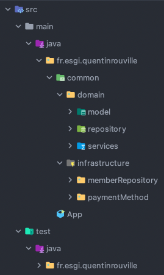

# Architecture Logicielle
| Année     | Auteur           | Version                   |
| --------- | ---------------- | ------------------------- |
| 2021/2022 | Quentin ROUVILLE | rouvilleq@gmail.com 1.0.0 |
***

## Objectifs
Le but de ce projet est de concevoir et développer un module logiciel de gestion des inscriptions d’une solution e-commerce, comportant une fonction d’ajout d’un membre.

# Architecture

## Packages

Pour ce projet j'ai adopté l'architecture suivante pour les packages Java :

# Liens utiles

[Le github du projet](https://github.com/QuentinROUVILLE/AL-CC1)